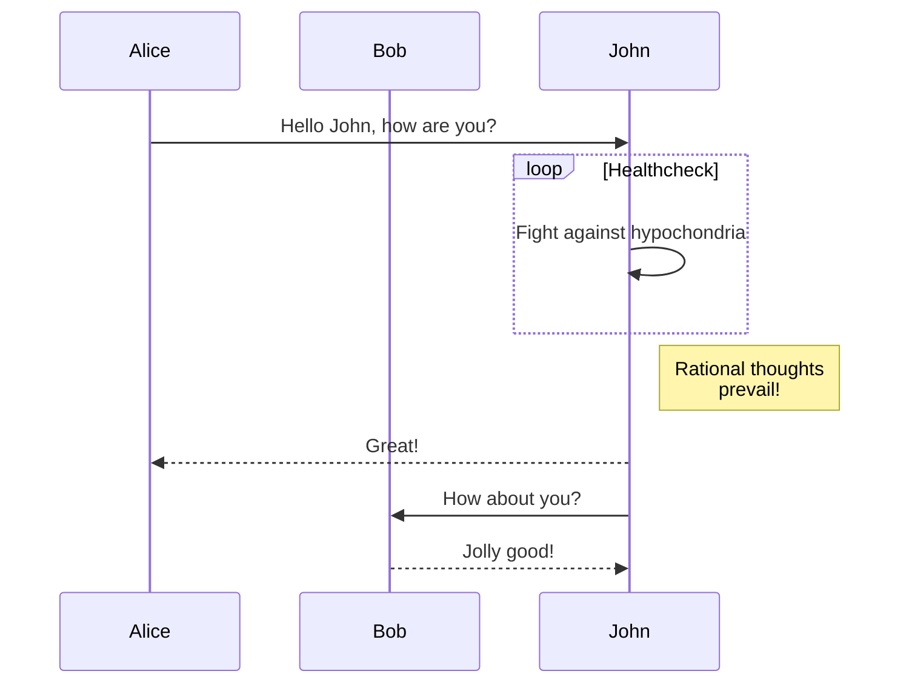
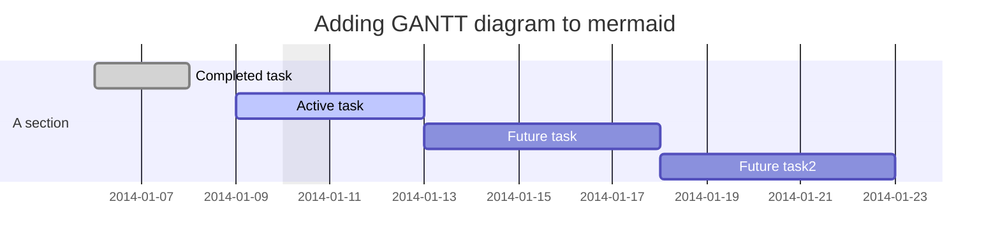
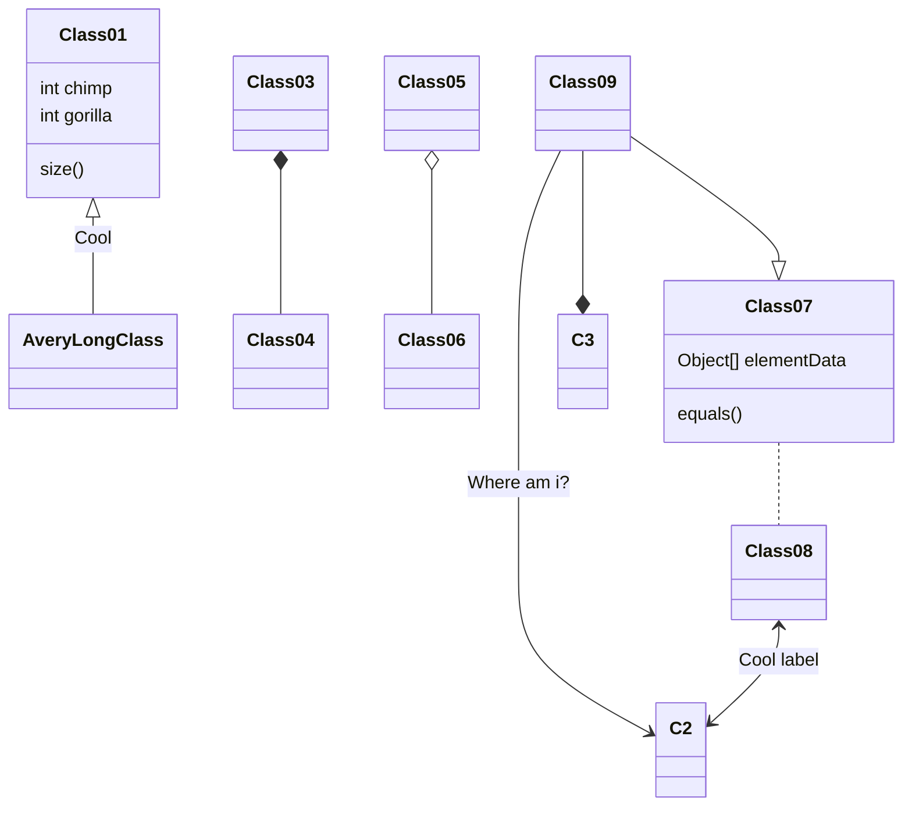

# mermaidで記述できるダイアグラムのチュートリアル

## Mermaidとは 
---
MermaidはJavaScript製のダイアグラム生成ツールでUMLなどのダイアグラムを生成するツール。テキストから図を生成できるが、グラフを生成することはできない。

公式サイトみると相当なことできるが使いこなすのは大変。簡易的なブロック図みたいなものでまずは利用できればいいかと思う。

## VSCodeでMermaidを使う手順
---
VSCodeのMarkdownで使えるようにするためには[Markdown All in One](https://marketplace.visualstudio.com/items?itemName=yzhang.markdown-all-in-one)と[Markdown Preview Mermaid Support](https://marketplace.visualstudio.com/items?itemName=bierner.markdown-mermaid)のアドオンをインストールする。

## 記法
バッククォート3つとmermaidで囲う
1. Flowchart
```
graph TD;
    A-->B;
    A-->C;
    B-->D;
    C-->D;
```

2. Sequence diagram
```
sequenceDiagram
    participant Alice
    participant Bob
    Alice->>John: Hello John, how are you?
    loop Healthcheck
        John->>John: Fight against hypochondria
    end
    Note right of John: Rational thoughts <br/>prevail!
    John-->>Alice: Great!
    John->>Bob: How about you?
    Bob-->>John: Jolly good!
```

3. Gantt diagram
```
gantt
dateFormat  YYYY-MM-DD
title Adding GANTT diagram to mermaid
excludes weekdays 2014-01-10

section A section
Completed task            :done,    des1, 2014-01-06,2014-01-08
Active task               :active,  des2, 2014-01-09, 3d
Future task               :         des3, after des2, 5d
Future task2               :         des4, after des3, 5d
```

4. Class diagram
```classDiagram
Class01 <|-- AveryLongClass : Cool
Class03 *-- Class04
Class05 o-- Class06
Class07 .. Class08
Class09 --> C2 : Where am i?
Class09 --* C3
Class09 --|> Class07
Class07 : equals()
Class07 : Object[] elementData
Class01 : size()
Class01 : int chimp
Class01 : int gorilla
Class08 <--> C2: Cool label
```

引用元:https://zenn.dev/usagi1975/articles/2023-02-17-233300_mermaid_memo
https://mermaid.js.org/intro/